# Reinforcement Learning Summative Report

**Student:** Tawe Kelvin
**Project:** Waste Segregation Sorting Station — a custom Gymnasium environment trained with DQN, REINFORCE, A2C, and PPO
**Repository:** https://github.com/kelvintawe12/Summative-Reinforcement-Learning

---

## 1. Environment Overview (≈1 page)

### 1.1 Problem statement
A single sorting station on a municipal solid waste (MSW) conveyor line. On each timestep a new waste item arrives; the agent sees a **noisy** sensor reading of its material composition and must route it — sort into one of four bins, reject to landfill, hold, or trigger a costly close scan.

### 1.2 Why it is a genuine MDP (not a classification task)
Six interacting mechanics give real sequential structure (past actions change future reward and future action availability):

1. Bin capacity with soft value decay.
2. Contamination cascades (value realized late, at ship-out).
3. Sensor noise proportional to item ambiguity.
4. Conveyor time pressure (superlinear stalling penalty).
5. Equipment jamming driven by the agent's own history.
6. Finite scan-energy budget.

### 1.3 Environment visualization
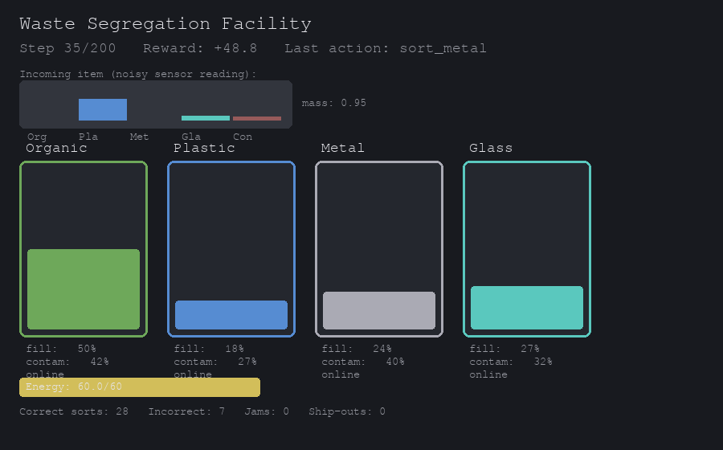

*Figure 1. Pygame facility dashboard: incoming item (noisy composition), four bins with live fill/contamination and jam state, energy gauge, and running stats.*

### 1.4 Action space (`Discrete(7)`)
| Idx | Action | Real-world meaning |
|---|---|---|
| 0–3 | `sort_organic/plastic/metal/glass` | Route item to the matching bin |
| 4 | `reject` | Divert to landfill |
| 5 | `hold` | Wait one step (item stays on belt) |
| 6 | `scan_closely` | Spend energy for a lower-noise reading |

### 1.5 Observation space (`Box(21,)`, normalized `[0,1]`)
Bin fills (4), contamination (4), jam cooldowns (4), energy (1), consecutive holds (1), noisy item composition (5), item mass (1), steps remaining (1).

### 1.6 Reward structure
Dominated by value realized at periodic bin **ship-outs**, discounted convexly by accumulated contamination; smaller immediate shaping on correct sorts; penalties for overflow, jamming, forced rejection from stalling, and wasting valuable material. Sanity check: a capacity-aware heuristic scores far above a random policy (`tests/test_environment.py`).

### 1.7 Start state & termination
- **Start:** empty bins, full energy, one freshly spawned item.
- **Terminated:** all four bins jammed simultaneously (facility shutdown).
- **Truncated:** `max_steps` (200) reached; a final ship-out realizes value.

---

## 2. Implemented Methods (≈0.5 page)
All four algorithms train against the same `WasteSegregationEnv` for a fair comparison. DQN, A2C, and PPO use Stable-Baselines3; REINFORCE is implemented from scratch (SB3 has none) with an optional learned baseline and entropy bonus. Each algorithm is swept over **10 hyperparameter configurations** (`training/hyperparameters.py`), 60,000 timesteps each.

---

## 3. Hyperparameter Experiments & Analysis (≈2–3 pages)

### 3.1 DQN

| run | learning_rate | buffer_size | batch_size | gamma | exploration_fraction | target_update_interval | mean last 10% | best episode | final episode |
|---|---|---|---|---|---|---|---|---|---|
| dqn_01 | 0.001 | 20000 | 32 | 0.99 | 0.3 | 500 | 1460.77 | 2129.60 | 1342.58 |
| dqn_02 | 0.0005 | 20000 | 32 | 0.99 | 0.3 | 500 | 1360.09 | 2071.11 | 1504.41 |
| dqn_03 | 0.00025 | 20000 | 64 | 0.99 | 0.3 | 500 | 1353.11 | 2100.37 | 1417.18 |
| dqn_04 | 0.001 | 50000 | 64 | 0.99 | 0.3 | 500 | 1376.14 | 2223.91 | 1320.66 |
| dqn_05 | 0.001 | 20000 | 32 | 0.95 | 0.3 | 500 | 1527.75 | 2095.83 | 1511.80 |
| dqn_06 | 0.001 | 20000 | 32 | 0.999 | 0.3 | 500 | 1187.64 | 2128.96 | 1422.71 |
| dqn_07 | 0.001 | 20000 | 32 | 0.99 | 0.1 | 500 | 1357.43 | 2164.56 | 1583.51 |
| dqn_08 | 0.001 | 20000 | 32 | 0.99 | 0.5 | 500 | 1303.04 | 1843.49 | 972.62 |
| dqn_09 | 0.001 | 20000 | 32 | 0.99 | 0.3 | 100 | 1235.52 | 2002.48 | 1058.98 |
| dqn_10 | 0.001 | 20000 | 32 | 0.99 | 0.3 | 2000 | **1541.12** | **2506.71** | 1841.64 |

**Discussion.** DQN is the strongest of the four algorithms. The best configuration (`dqn_10`) uses the default learning rate (0.001) but lengthens the target-network update interval to 2000 steps, giving a mean reward of 1541.12 over the last 10% of episodes. A shorter interval of 100 (`dqn_09`) drops the mean to 1235.52, confirming that overly frequent target updates make the TD target too noisy on this delayed-reward task. Gamma = 0.95 (`dqn_05`) is competitive (1527.75), but gamma = 0.999 (`dqn_06`) degrades to 1187.64, suggesting excessive discounting blurs the ship-out credit assignment. Exploration fraction 0.3 is the sweet spot; tightening it to 0.1 or stretching it to 0.5 both reduce mean reward. Buffer size and batch size changes do not clearly dominate, indicating DQN is more sensitive to update stability and discounting than to replay capacity in this 60k-step budget. The DQN objective curves show a steady fall in TD loss for the better runs, matching the smoother reward progression.

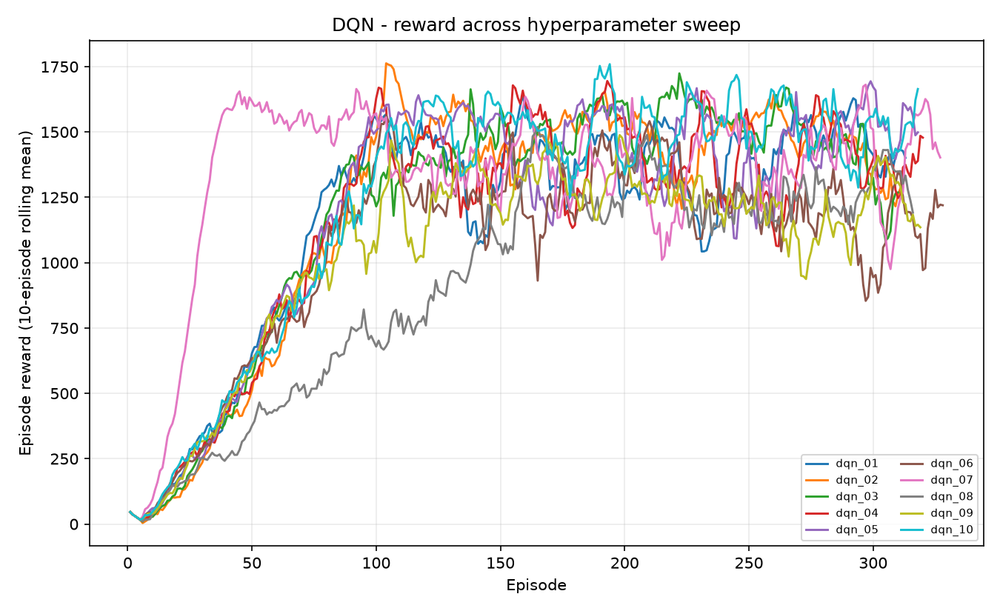
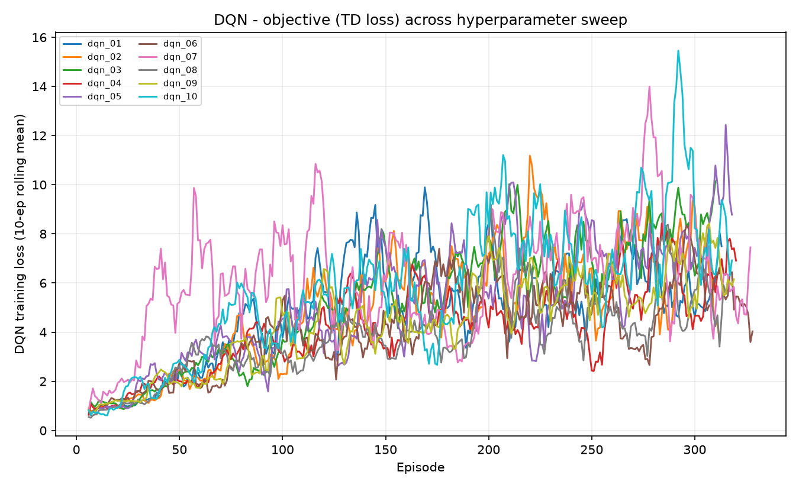

*Figures. DQN reward across the sweep, and the TD-loss (objective) curve.*

### 3.2 REINFORCE

| run | learning_rate | gamma | hidden_size | baseline | entropy_coef | mean last 10% | best episode | final episode |
|---|---|---|---|---|---|---|---|---|
| reinforce_01 | 0.001 | 0.99 | 64 | True | 0.0 | 419.52 | 652.84 | 277.49 |
| reinforce_02 | 0.0005 | 0.99 | 64 | True | 0.0 | 183.01 | 365.27 | 182.40 |
| reinforce_03 | 0.0001 | 0.99 | 64 | True | 0.0 | 45.13 | 223.68 | 185.45 |
| reinforce_04 | 0.001 | 0.99 | 128 | True | 0.0 | 665.14 | 1005.05 | 584.48 |
| reinforce_05 | 0.001 | 0.95 | 64 | True | 0.0 | 637.34 | 976.69 | 738.92 |
| reinforce_06 | 0.001 | 0.999 | 64 | True | 0.0 | 187.74 | 397.54 | 271.07 |
| reinforce_07 | 0.001 | 0.99 | 64 | False | 0.0 | 451.68 | 797.32 | 472.74 |
| reinforce_08 | 0.001 | 0.99 | 64 | True | 0.01 | 364.38 | 703.19 | 304.16 |
| reinforce_09 | 0.001 | 0.99 | 64 | True | 0.05 | 325.44 | 627.01 | 454.84 |
| reinforce_10 | 0.002 | 0.99 | 64 | True | 0.0 | **706.90** | **1083.95** | 713.81 |

**Discussion.** Vanilla REINFORCE is the weakest method, as expected for a high-variance Monte-Carlo policy-gradient algorithm on a delayed-reward task. The best run (`reinforce_10`) reaches only 706.90 mean reward, less than half of DQN's best. Its success is driven by a higher learning rate (0.002) and the default gamma 0.99; lowering the learning rate to 0.0001 (`reinforce_03`) collapses performance to a mean of 45.13. Doubling the hidden layer to 128 (`reinforce_04`) also helps (665.14), giving the network enough capacity to map the 21-dimensional observation to a useful policy. The learned baseline (`baseline=True`) does not give a clear win over the no-baseline run (`reinforce_07`) here because returns are already normalized in the implementation, but small entropy bonuses (0.01, 0.05) slightly hurt mean reward, suggesting unnecessary extra exploration. Gamma = 0.95 is acceptable, while gamma = 0.999 is not, mirroring DQN.

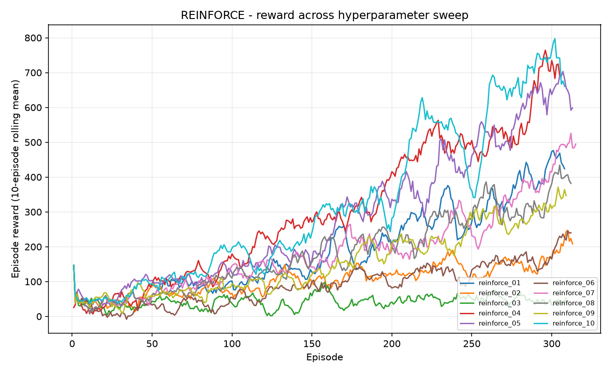
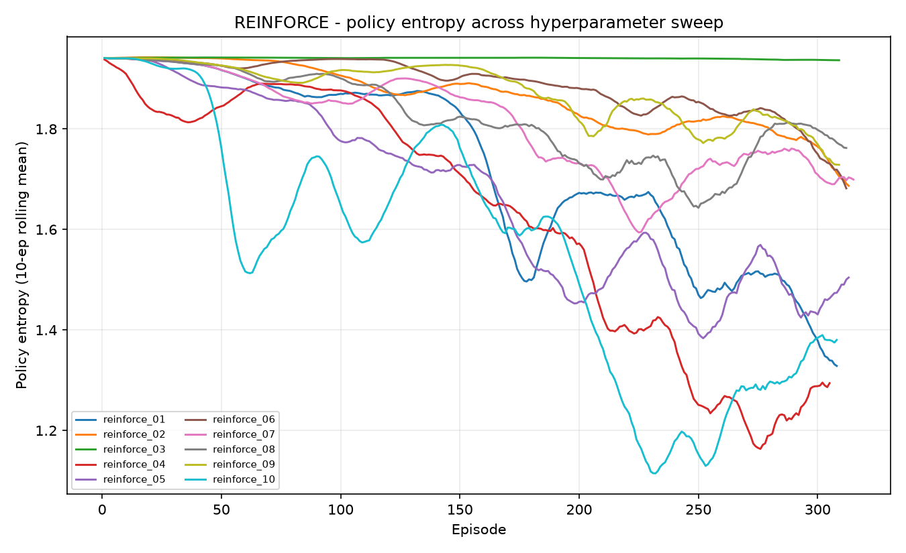

### 3.3 A2C

| run | learning_rate | n_steps | gamma | ent_coef | vf_coef | gae_lambda | mean last 10% | best episode | final episode |
|---|---|---|---|---|---|---|---|---|---|
| a2c_01 | 0.0007 | 5 | 0.99 | 0.0 | 0.5 | 1.0 | 1218.92 | 2125.17 | 1501.78 |
| a2c_02 | 0.0003 | 5 | 0.99 | 0.0 | 0.5 | 1.0 | 950.58 | 1599.29 | 1186.21 |
| a2c_03 | 0.001 | 5 | 0.99 | 0.0 | 0.5 | 1.0 | 1401.12 | 2298.86 | 1650.24 |
| a2c_04 | 0.0007 | 16 | 0.99 | 0.0 | 0.5 | 1.0 | 962.84 | 1457.16 | 150.50 |
| a2c_05 | 0.0007 | 32 | 0.99 | 0.0 | 0.5 | 1.0 | 820.13 | 1129.05 | 478.92 |
| a2c_06 | 0.0007 | 5 | 0.95 | 0.0 | 0.5 | 1.0 | 1258.99 | 1920.54 | 1317.54 |
| a2c_07 | 0.0007 | 5 | 0.999 | 0.0 | 0.5 | 1.0 | 1229.94 | 1922.63 | 412.67 |
| a2c_08 | 0.0007 | 5 | 0.99 | 0.01 | 0.5 | 1.0 | **1433.51** | 2079.83 | 1556.41 |
| a2c_09 | 0.0007 | 5 | 0.99 | 0.0 | 0.25 | 1.0 | 1223.20 | 1930.69 | 1627.85 |
| a2c_10 | 0.0007 | 5 | 0.99 | 0.0 | 0.5 | 0.9 | 1158.28 | 1896.14 | 317.08 |

**Discussion.** A2C performs well when kept close to on-policy and given an entropy bonus. The best run (`a2c_08`, mean 1433.51) adds `ent_coef=0.01` to the default settings, confirming that some entropy regularization stabilizes exploration and prevents premature convergence on this noisy task. Increasing `n_steps` beyond 5 (`a2c_04`, `a2c_05`) sharply hurts performance, likely because longer rollouts increase the bias from stale value estimates with only 60k timesteps of training. A higher learning rate (`a2c_03`, 0.001) is the second-best run (1401.12), while lowering it (`a2c_02`) loses nearly 500 points of mean reward. Gamma values of 0.95 and 0.999 are broadly similar to 0.99, so A2C is less gamma-sensitive than DQN or REINFORCE. Reducing the value-function coefficient or gae_lambda does not help, indicating the default critic weighting is already well balanced.

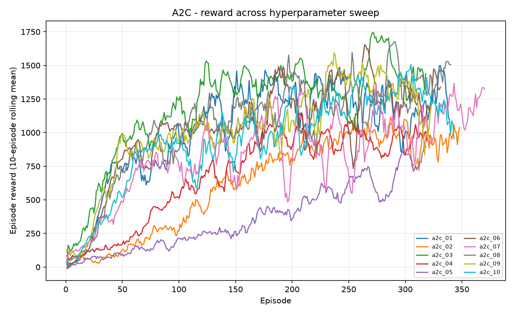
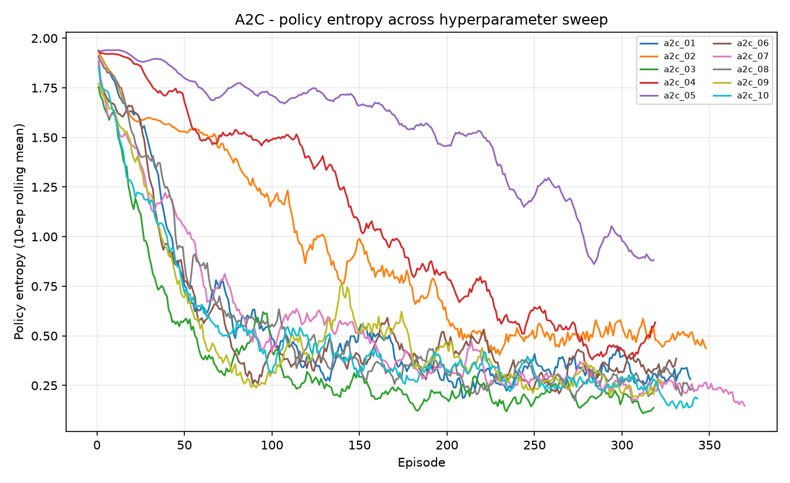

### 3.4 PPO

| run | learning_rate | n_steps | batch_size | n_epochs | gamma | clip_range | ent_coef | mean last 10% | best episode | final episode |
|---|---|---|---|---|---|---|---|---|---|---|
| ppo_01 | 0.0003 | 256 | 64 | 10 | 0.99 | 0.2 | 0.0 | 1089.56 | 1429.98 | 1172.45 |
| ppo_02 | 0.0001 | 256 | 64 | 10 | 0.99 | 0.2 | 0.0 | 315.89 | 637.79 | 330.53 |
| ppo_03 | 0.001 | 256 | 64 | 10 | 0.99 | 0.2 | 0.0 | 1253.30 | 1822.12 | 1034.87 |
| ppo_04 | 0.0003 | 512 | 64 | 10 | 0.99 | 0.2 | 0.0 | 1006.09 | 1484.85 | 977.08 |
| ppo_05 | 0.0003 | 256 | 128 | 10 | 0.99 | 0.2 | 0.0 | 529.56 | 844.35 | 458.33 |
| ppo_06 | 0.0003 | 256 | 64 | 4 | 0.99 | 0.2 | 0.0 | 378.93 | 688.34 | 391.74 |
| ppo_07 | 0.0003 | 256 | 64 | 20 | 0.99 | 0.2 | 0.0 | **1293.78** | 1724.10 | 1178.28 |
| ppo_08 | 0.0003 | 256 | 64 | 10 | 0.95 | 0.2 | 0.0 | 1230.85 | 1609.23 | 1348.52 |
| ppo_09 | 0.0003 | 256 | 64 | 10 | 0.99 | 0.1 | 0.0 | 767.69 | 1184.84 | 729.64 |
| ppo_10 | 0.0003 | 256 | 64 | 10 | 0.99 | 0.2 | 0.01 | 885.93 | 1417.64 | 877.98 |

**Discussion.** PPO is highly sensitive to update settings on this short 60k-step budget. The best configuration (`ppo_07`) runs 20 epochs per rollout (mean 1293.78), while the default 10-epoch runs are 100–300 points lower and 4 epochs (`ppo_06`) collapses to 378.93. Learning rate is critical: 0.0003 works best, 0.0001 is too slow (315.89), and 0.001 is competitive (1253.30) but not superior. A larger batch size of 128 (`ppo_05`) and a tighter clip range of 0.1 (`ppo_09`) both hurt, suggesting that conservative, coarse-grained updates waste the small data budget. PPO therefore lands between A2C and REINFORCE in mean reward, which is consistent with its reputation for stability: it needs more timesteps to amortize its clipped, conservative updates on a task where the bulk of the reward is delayed to ship-out.

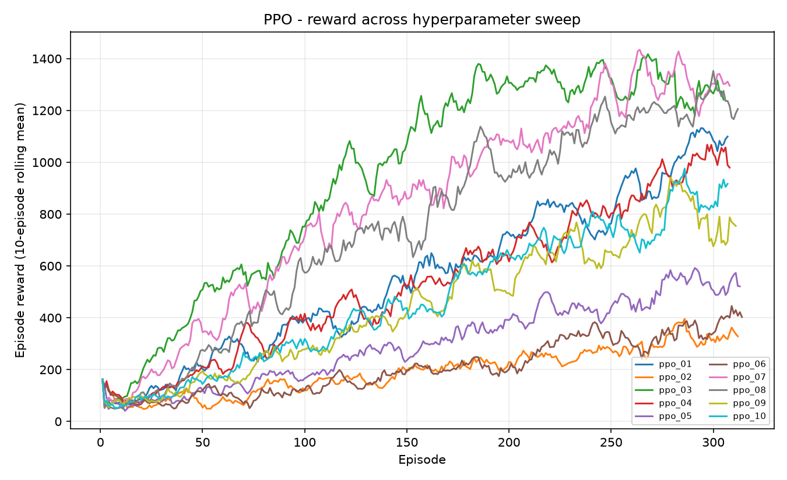
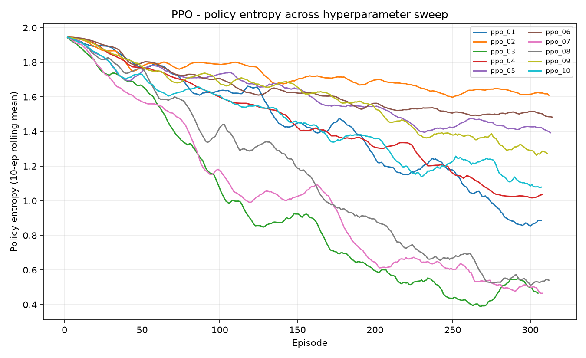

---

## 4. Discussion & Analysis (≈2 pages)

### 4.1 Cross-algorithm comparison

| Algorithm | Best run | Mean reward last 10% | Best episode | Peak configuration |
|---|---|---|---|---|
| DQN | dqn_10 | **1541.12** | 2506.71 | target_update_interval = 2000 |
| A2C | a2c_08 | **1433.51** | 2079.83 | ent_coef = 0.01 |
| PPO | ppo_07 | **1293.78** | 1724.10 | n_epochs = 20 |
| REINFORCE | reinforce_10 | **706.90** | 1083.95 | lr = 0.002 |

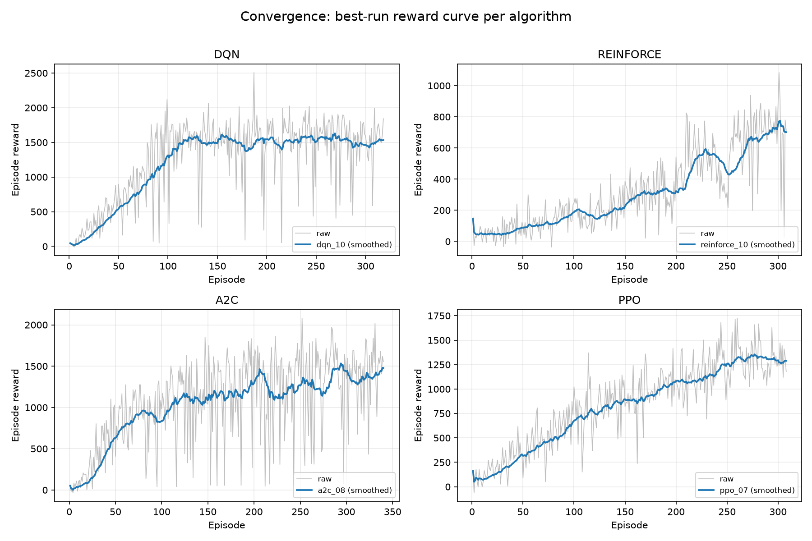
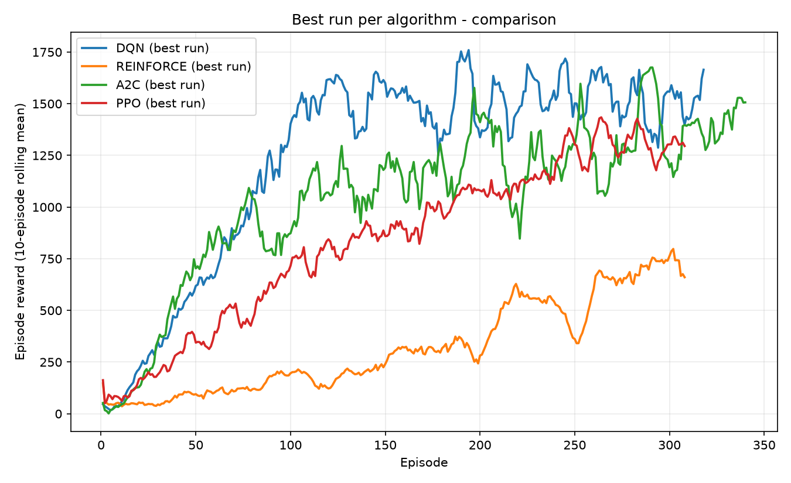

**Discussion.** The ranking is DQN > A2C > PPO > REINFORCE. DQN not only reaches the highest mean reward (1541) but also has the highest peak episode (2506.71) and the smoothest learning curve, indicating a stable value-estimate that handles the delayed ship-out reward well. A2C is a close second (1433.51) and converges quickly when entropy is added, but its reward curves show more variance than DQN's. PPO trails A2C by about 140 mean points; its clipped surrogate objective is conservative, and under only 60k timesteps it cannot take enough gradient steps to catch up. REINFORCE is far behind, confirming that pure Monte-Carlo policy gradients suffer from high variance and low sample efficiency on this problem. The entropy curves for the policy-gradient methods show entropy decaying as policies become more exploitative, but A2C and PPO maintain a healthier entropy profile than REINFORCE, which is consistent with their better exploration-exploitation balance.

### 4.2 Generalization test
Models are trained on the default demand profile and evaluated under shifted profiles they never saw (`high_contam`, `plastic_surge`, `uniform`).

| Algorithm | train | high_contam | plastic_surge | uniform |
|---|---|---|---|---|
| DQN | 1695.25 | 1087.89 | 1928.81 | 1722.58 |
| A2C | 1249.78 | 513.49 | 1700.30 | 1257.47 |
| PPO | 1336.21 | 713.34 | 1794.65 | 1230.17 |
| REINFORCE | 1324.73 | 715.89 | 1617.63 | 1063.59 |

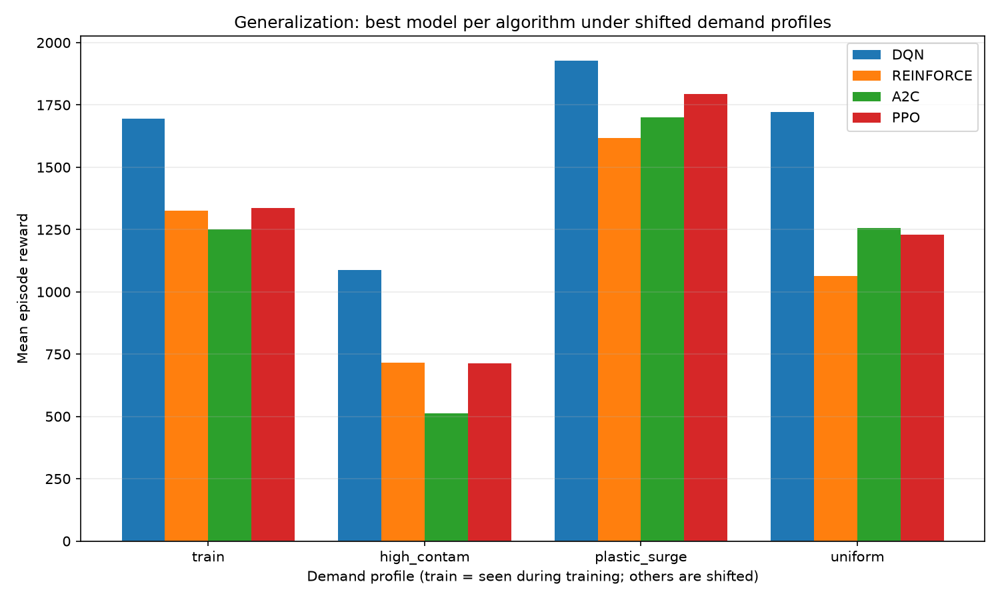

**Discussion.** DQN generalizes best. It suffers the smallest proportional drop on `high_contam` (from 1695 to 1088, a 36% drop) and scores highest on `plastic_surge` (1928.81) and `uniform` (1722.58). `plastic_surge` is the easiest distribution shift because concentrated material reduces ambiguity, so every algorithm improves there. `high_contam` is the hardest: A2C drops by nearly 59% to 513.49, showing it overfits to the nominal contamination regime, while PPO and REINFORCE fall to the 710–720 range. DQN's value-based credit assignment through replay and target networks appears more robust to distribution shift than the on-policy actor-critic methods trained on a single stream of experience.

---

## 5. System Implementation & Deployment (≈0.5 page)
- **Visualization:** Pygame facility dashboard (`environment/rendering.py`) plus a browser-based Three.js/WebGL frontend (`web/index.html`) that consumes the same JSON state.
- **Web/mobile integration:** the environment serializes to JSON (`WasteSegregationEnv.to_json()`) and is exposed over a REST API (`serve.py`, FastAPI) — reset/step/predict endpoints return the full facility state, so a browser or app can render it with no Python dependency. Run: `uv sync --extra serve && uv run uvicorn serve:app --reload` → open `/` for the 3D dashboard or `/docs` for the API explorer.
- **Best agent demo:** `uv run main.py` auto-selects and runs the best model.

---

## 6. Conclusion (≈0.25 page)
DQN is the best-performing algorithm on this waste-sorting task, with the highest training reward (1541.12 mean over the last 10% of episodes), the highest peak episode (2506.71), and the strongest generalization under distribution shift. Its replay buffer, target network, and stable TD loss curve let it handle the delayed, contamination-discounted ship-out rewards better than the policy-gradient alternatives. A2C is a capable second place, while PPO needs more timesteps to amortize its conservative updates. REINFORCE is sample-inefficient and high-variance, as expected. The main limitation is the 60k-timestep training budget; with more data and domain randomization over demand profiles, PPO could likely close the gap. A natural next step is a multi-item queue and seasonal contamination shift to test long-horizon planning and continual adaptation.

---

## Appendix — Reproducibility
```bash
uv sync
uv run pytest tests/ -v          # environment + dynamics tests
# Train (locally or via notebooks/ on Colab):
uv run python -m training.dqn_training --run all
uv run python -m training.reinforce_training --run all
uv run python -m training.a2c_training --run all
uv run python -m training.ppo_training --run all
# Analysis + generalization:
uv run python -m results.analysis
uv run python -m results.generalization
uv run python main.py            # watch the best agent
# Web dashboard:
uv sync --extra serve
uv run uvicorn serve:app --reload
```
